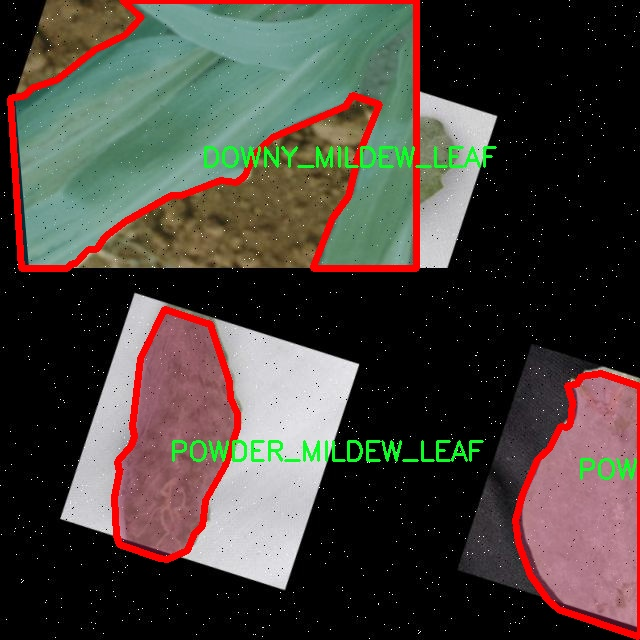

# 植物病害图像分割系统源码＆数据集分享
 [yolov8-seg-EfficientFormerV2＆yolov8-seg-repvit等50+全套改进创新点发刊_一键训练教程_Web前端展示]

### 1.研究背景与意义

项目参考[ILSVRC ImageNet Large Scale Visual Recognition Challenge](https://gitee.com/YOLOv8_YOLOv11_Segmentation_Studio/projects)

项目来源[AAAI Global Al lnnovation Contest](https://kdocs.cn/l/cszuIiCKVNis)

研究背景与意义

植物病害的发生不仅影响农作物的生长和产量，还对全球农业经济和生态环境造成了严重威胁。随着全球气候变化和农业生产方式的转变，植物病害的种类和传播速度日益增加，给农业生产带来了前所未有的挑战。因此，及时、准确地识别和诊断植物病害，成为保障农业可持续发展和食品安全的重要任务。传统的植物病害识别方法多依赖于人工观察和经验判断，存在效率低、准确性差等问题，难以满足现代农业生产的需求。随着计算机视觉和深度学习技术的快速发展，基于图像处理的植物病害识别系统逐渐成为研究热点。

在众多深度学习模型中，YOLO（You Only Look Once）系列因其高效的实时目标检测能力而受到广泛关注。YOLOv8作为该系列的最新版本，进一步提升了检测精度和速度，适用于复杂背景下的目标检测任务。然而，针对植物病害图像的特征，YOLOv8仍存在一定的局限性，尤其是在细粒度的图像分割任务中。因此，基于改进YOLOv8的植物病害图像分割系统的研究具有重要的现实意义。

本研究将利用包含1700幅图像的植物病害数据集，该数据集涵盖了9个类别，包括多种植物病害（如霜霉病、叶蠹病、白粉病等）以及健康植物的不同部位（如花、叶、荚）。通过对这些图像进行深度学习训练，可以实现对植物病害的高效识别和分割。尤其是在实例分割任务中，模型不仅需要识别出病害的存在，还需精确分割出病害区域与健康区域，这对于后续的病害管理和防治措施具有重要指导意义。

此外，改进YOLOv8的研究将推动深度学习在农业领域的应用，提升农业智能化水平。通过实现对植物病害的自动化识别和分割，农民可以更快速地获取病害信息，从而采取及时的防治措施，减少农药的使用，提高作物的产量和质量。同时，该系统的推广应用还将为农业管理部门提供科学依据，帮助制定更为合理的病害防治策略，促进农业可持续发展。

综上所述，基于改进YOLOv8的植物病害图像分割系统的研究，不仅具有重要的学术价值，还具备广泛的应用前景。通过对植物病害的高效识别与分割，将为现代农业的智能化、精准化管理提供有力支持，助力全球农业的可持续发展与生态平衡。

### 2.图片演示


##### 注意：由于此博客编辑较早，上面“2.图片演示”和“3.视频演示”展示的系统图片或者视频可能为老版本，新版本在老版本的基础上升级如下：（实际效果以升级的新版本为准）

  （1）适配了YOLOV8的“目标检测”模型和“实例分割”模型，通过加载相应的权重（.pt）文件即可自适应加载模型。

  （2）支持“图片识别”、“视频识别”、“摄像头实时识别”三种识别模式。

  （3）支持“图片识别”、“视频识别”、“摄像头实时识别”三种识别结果保存导出，解决手动导出（容易卡顿出现爆内存）存在的问题，识别完自动保存结果并导出到tempDir中。

  （4）支持Web前端系统中的标题、背景图等自定义修改，后面提供修改教程。

  另外本项目提供训练的数据集和训练教程,暂不提供权重文件（best.pt）,需要您按照教程进行训练后实现图片演示和Web前端界面演示的效果。

### 3.视频演示

[3.1 视频演示](https://www.bilibili.com/video/BV1Ai1KYkEa4/)

### 4.数据集信息展示

##### 4.1 本项目数据集详细数据（类别数＆类别名）

nc: 9
names: ['DOWNY_MILDEW_LEAF', 'LEAFMINNER_LEAF', 'POWDER_MILDEW_LEAF', 'diseas_flower', 'diseas_pod', 'healthy_flower', 'healthy_leaf', 'healthy_pod', 'rust']


##### 4.2 本项目数据集信息介绍

数据集信息展示

在本研究中，我们采用了名为“plant_diseases”的数据集，以支持改进YOLOv8-seg的植物病害图像分割系统的训练与验证。该数据集专注于植物病害的识别与分类，包含了丰富的图像样本，旨在提高计算机视觉模型在农业领域的应用效果。数据集的类别数量为9，涵盖了多种植物病害及健康状态的图像，具体类别包括：DOWNY_MILDEW_LEAF、LEAFMINNER_LEAF、POWDER_MILDEW_LEAF、diseas_flower、diseas_pod、healthy_flower、healthy_leaf、healthy_pod以及rust。

首先，DOWNY_MILDEW_LEAF（霜霉病叶片）是由霜霉菌引起的一种常见植物病害，通常表现为叶片上出现黄绿色斑点，后期发展为白色霉层。该类别的图像样本对于模型学习如何识别该病害的特征至关重要。其次，LEAFMINNER_LEAF（叶蛆病叶片）是由叶蛆虫引起的，受害叶片常常呈现出不规则的透明斑点，影响植物的光合作用和生长。POWDER_MILDEW_LEAF（白粉病叶片）则是另一种常见的真菌病害，特征是叶片表面覆盖白色粉状物，严重时会导致叶片枯萎。

在花朵和荚果的病害方面，数据集中包含了diseas_flower（病害花朵）和diseas_pod（病害荚果）类别，这些样本对于识别植物在不同生长阶段所遭受的病害同样重要。健康状态的样本也被纳入数据集中，包括healthy_flower（健康花朵）、healthy_leaf（健康叶片）和healthy_pod（健康荚果），这些样本为模型提供了对比的基础，帮助其更好地理解病害与健康状态之间的差异。

最后，rust（锈病）作为一种影响广泛的植物病害，其特征是叶片上出现红褐色的锈斑，能够显著降低植物的产量。通过对这些不同类别的图像进行分析和学习，YOLOv8-seg模型将能够在实际应用中实现高效的植物病害检测与分割。

“plant_diseases”数据集不仅为我们提供了多样化的图像样本，还涵盖了植物在不同生长阶段及不同健康状态下的表现。这些信息的丰富性和多样性为模型的训练提供了坚实的基础，使其能够在复杂的农业环境中更准确地识别和分割植物病害。通过对这些数据的深入分析与处理，我们期望能显著提升YOLOv8-seg在植物病害图像分割任务中的性能，为农业生产提供更为智能化的解决方案。





### 5.全套项目环境部署视频教程（零基础手把手教学）

[5.1 环境部署教程链接（零基础手把手教学）](https://www.bilibili.com/video/BV1jG4Ve4E9t/?vd_source=bc9aec86d164b67a7004b996143742dc)


[5.2 安装Python虚拟环境创建和依赖库安装视频教程链接（零基础手把手教学）](https://www.bilibili.com/video/BV1nA4VeYEze/?vd_source=bc9aec86d164b67a7004b996143742dc)

### 6.手把手YOLOV8-seg训练视频教程（零基础小白有手就能学会）

[6.1 手把手YOLOV8-seg训练视频教程（零基础小白有手就能学会）](https://www.bilibili.com/video/BV1cA4VeYETe/?vd_source=bc9aec86d164b67a7004b996143742dc)


按照上面的训练视频教程链接加载项目提供的数据集，运行train.py即可开始训练



     Epoch   gpu_mem       box       obj       cls    labels  img_size
     1/200     0G   0.01576   0.01955  0.007536        22      1280: 100%|██████████| 849/849 [14:42<00:00,  1.04s/it]
               Class     Images     Labels          P          R     mAP@.5 mAP@.5:.95: 100%|██████████| 213/213 [01:14<00:00,  2.87it/s]
                 all       3395      17314      0.994      0.957      0.0957      0.0843

     Epoch   gpu_mem       box       obj       cls    labels  img_size
     2/200     0G   0.01578   0.01923  0.007006        22      1280: 100%|██████████| 849/849 [14:44<00:00,  1.04s/it]
               Class     Images     Labels          P          R     mAP@.5 mAP@.5:.95: 100%|██████████| 213/213 [01:12<00:00,  2.95it/s]
                 all       3395      17314      0.996      0.956      0.0957      0.0845

     Epoch   gpu_mem       box       obj       cls    labels  img_size
     3/200     0G   0.01561    0.0191  0.006895        27      1280: 100%|██████████| 849/849 [10:56<00:00,  1.29it/s]
               Class     Images     Labels          P          R     mAP@.5 mAP@.5:.95: 100%|███████   | 187/213 [00:52<00:00,  4.04it/s]
                 all       3395      17314      0.996      0.957      0.0957      0.0845


### 7.50+种全套YOLOV8-seg创新点代码加载调参视频教程（一键加载写好的改进模型的配置文件）

[7.1 50+种全套YOLOV8-seg创新点代码加载调参视频教程（一键加载写好的改进模型的配置文件）](https://www.bilibili.com/video/BV1Hw4VePEXv/?vd_source=bc9aec86d164b67a7004b996143742dc)

### 8.YOLOV8-seg图像分割算法原理

原始YOLOV8-seg算法原理

YOLOv8-seg算法是Ultralytics公司在2023年推出的YOLO系列中的最新版本，旨在提升目标检测和图像分割的性能与效率。该算法在YOLOv5的基础上进行了多项创新，特别是在网络结构、特征提取和损失函数等方面的改进，使其在处理复杂场景时表现出色。YOLOv8-seg的核心在于其高效的特征提取能力和灵活的网络设计，能够在不同的应用场景中实现快速且准确的目标检测与分割。

首先，YOLOv8-seg采用了C2f模块来替代YOLOv5中的C3模块。C2f模块的设计灵感来源于CSPNet的分流思想，它通过并行化多个梯度流分支来增强特征提取的能力。这种结构不仅保持了模型的轻量化特性，还提高了特征的丰富性，从而在保持较低延迟的同时提升了模型的精度。C2f模块的引入使得YOLOv8-seg在处理不同尺度的目标时，能够更好地捕捉到细节信息，尤其是在复杂背景下的目标分割任务中。

在主干网络方面，YOLOv8-seg继续使用CSP结构，将特征提取过程分为两个部分，分别进行卷积和连接。这种设计不仅提高了特征提取的效率，还使得网络在处理不同特征层次时能够更加灵活。通过将特征金字塔网络（FPN）与路径聚合网络（PAN）结合，YOLOv8-seg能够实现多尺度特征的有效融合。这种融合方式使得网络能够更好地利用不同层次的特征信息，从而提升了对小目标和复杂目标的检测能力。

YOLOv8-seg的输入处理也经过了优化。默认情况下，输入图像的尺寸为640x640，但在实际应用中，图像的长宽比往往不一致。为了解决这一问题，YOLOv8-seg采用了自适应图像缩放技术，将较长的一边按比例缩小到指定尺寸，然后对短边进行填充。这种方法不仅减少了填充带来的信息冗余，还提高了模型在推理时的速度。此外，在训练过程中，YOLOv8-seg使用了Mosaic图像增强技术，通过随机拼接多张图像来丰富训练样本，从而提升模型的泛化能力和预测精度。

在检测头的设计上，YOLOv8-seg进行了显著的改进，采用了解耦头结构（Decoupled-Head）。这一结构将检测和分类的卷积分开，使得模型在进行目标检测时能够更专注于每个任务的特征提取。这种解耦设计使得YOLOv8-seg在处理复杂场景时，能够更有效地识别目标类别和位置。同时，YOLOv8-seg抛弃了传统的Anchor-Based方法，转而采用Anchor-Free的检测方式。这一创新使得模型在处理不同尺寸和形状的目标时，具有更强的灵活性和适应性，减少了对预设锚框的依赖。

在损失函数的设计上，YOLOv8-seg引入了Distribution Focal Loss（DFL）和CIoU Loss，以提高模型在训练过程中的收敛速度和准确性。DFL通过对目标分布的关注，使得模型能够更快地聚焦于标签附近的区域，而CIoU Loss则通过考虑目标框的中心点、宽高比和重叠度，进一步提升了边界框回归的精度。这种损失函数的组合使得YOLOv8-seg在训练过程中能够更好地平衡目标检测的准确性和召回率。

综上所述，YOLOv8-seg算法通过一系列创新的设计和优化，显著提升了目标检测和图像分割的性能。其在特征提取、网络结构、输入处理和损失函数等方面的改进，使得YOLOv8-seg在面对复杂场景时，能够快速、准确地识别和分割目标。随着YOLOv8-seg的广泛应用，预计其将在智能监控、自动驾驶、医疗影像分析等领域发挥重要作用，为相关研究和应用提供强有力的支持。


### 9.系统功能展示（检测对象为举例，实际内容以本项目数据集为准）

图9.1.系统支持检测结果表格显示

  图9.2.系统支持置信度和IOU阈值手动调节

  图9.3.系统支持自定义加载权重文件best.pt(需要你通过步骤5中训练获得)

  图9.4.系统支持摄像头实时识别

  图9.5.系统支持图片识别

  图9.6.系统支持视频识别

  图9.7.系统支持识别结果文件自动保存

  图9.8.系统支持Excel导出检测结果数据


### 10.50+种全套YOLOV8-seg创新点原理讲解（非科班也可以轻松写刊发刊，V11版本正在科研待更新）

#### 10.1 由于篇幅限制，每个创新点的具体原理讲解就不一一展开，具体见下列网址中的创新点对应子项目的技术原理博客网址【Blog】：


[10.1 50+种全套YOLOV8-seg创新点原理讲解链接](https://gitee.com/qunmasj/good)

#### 10.2 部分改进模块原理讲解(完整的改进原理见上图和技术博客链接)【如果此小节的图加载失败可以通过CSDN或者Github搜索该博客的标题访问原始博客，原始博客图片显示正常】

### YOLOv8简介

按照官方描述，YOLOv8 是一个 SOTA 模型，它建立在以前 YOLO 版本的成功基础上，并引入了新的功能和改进，以进一步提升性能和灵活性。具体创新包括一个新的骨干网络、一个新的 Ancher-Free 检测头和一个新的损失函数，可以在从 CPU 到 GPU 的各种硬件平台上运行。

不过 ultralytics 并没有直接将开源库命名为 YOLOv8，而是直接使用 ultralytics 这个词，原因是 ultralytics 将这个库定位为算法框架，而非某一个特定算法，一个主要特点是可扩展性。其希望这个库不仅仅能够用于 YOLO 系列模型，而是能够支持非 YOLO 模型以及分类分割姿态估计等各类任务。
总而言之，ultralytics 开源库的两个主要优点是：

融合众多当前 SOTA 技术于一体
未来将支持其他 YOLO 系列以及 YOLO 之外的更多算法


下表为官方在 COCO Val 2017 数据集上测试的 mAP、参数量和 FLOPs 结果。可以看出 YOLOv8 相比 YOLOv5 精度提升非常多，但是 N/S/M 模型相应的参数量和 FLOPs 都增加了不少，从上图也可以看出相比 YOLOV5 大部分模型推理速度变慢了。


额外提一句，现在各个 YOLO 系列改进算法都在 COCO 上面有明显性能提升，但是在自定义数据集上面的泛化性还没有得到广泛验证，至今依然听到不少关于 YOLOv5 泛化性能较优异的说法。对各系列 YOLO 泛化性验证也是 MMYOLO 中一个特别关心和重点发力的方向。

### YOLO-MS简介
实时目标检测，以YOLO系列为例，已在工业领域中找到重要应用，特别是在边缘设备（如无人机和机器人）中。与之前的目标检测器不同，实时目标检测器旨在在速度和准确性之间追求最佳平衡。为了实现这一目标，提出了大量的工作：从第一代DarkNet到CSPNet，再到最近的扩展ELAN，随着性能的快速增长，实时目标检测器的架构经历了巨大的变化。

尽管性能令人印象深刻，但在不同尺度上识别对象仍然是实时目标检测器面临的基本挑战。这促使作者设计了一个强大的编码器架构，用于学习具有表现力的多尺度特征表示。具体而言，作者从两个新的角度考虑为实时目标检测编码多尺度特征：

从局部视角出发，作者设计了一个具有简单而有效的分层特征融合策略的MS-Block。受到Res2Net的启发，作者在MS-Block中引入了多个分支来进行特征提取，但不同的是，作者使用了一个带有深度卷积的 Inverted Bottleneck Block块，以实现对大Kernel的高效利用。

从全局视角出发，作者提出随着网络加深逐渐增加卷积的Kernel-Size。作者在浅层使用小Kernel卷积来更高效地处理高分辨率特征。另一方面，在深层中，作者采用大Kernel卷积来捕捉广泛的信息。

基于以上设计原则，作者呈现了作者的实时目标检测器，称为YOLO-MS。为了评估作者的YOLO-MS的性能，作者在MS COCO数据集上进行了全面的实验。还提供了与其他最先进方法的定量比较，以展示作者方法的强大性能。如图1所示，YOLO-MS在计算性能平衡方面优于其他近期的实时目标检测器。


具体而言，YOLO-MS-XS在MS COCO上获得了43%+的AP得分，仅具有450万个可学习参数和8.7亿个FLOPs。YOLO-MS-S和YOLO-MS分别获得了46%+和51%+的AP，可学习参数分别为810万和2220万。此外，作者的工作还可以作为其他YOLO模型的即插即用模块。通常情况下，作者的方法可以将YOLOv8的AP从37%+显著提高到40%+，甚至还可以使用更少的参数和FLOPs。


#### Multi-Scale Building Block Design
CSP Block是一个基于阶段级梯度路径的网络，平衡了梯度组合和计算成本。它是广泛应用于YOLO系列的基本构建块。已经提出了几种变体，包括YOLOv4和YOLOv5中的原始版本，Scaled YOLOv4中的CSPVoVNet，YOLOv7中的ELAN，以及RTMDet中提出的大Kernel单元。作者在图2(a)和图2(b)中分别展示了原始CSP块和ELAN的结构。


上述实时检测器中被忽视的一个关键方面是如何在基本构建块中编码多尺度特征。其中一个强大的设计原则是Res2Net，它聚合了来自不同层次的特征以增强多尺度表示。然而，这一原则并没有充分探索大Kernel卷积的作用，而大Kernel卷积已经在基于CNN的视觉识别任务模型中证明有效。将大Kernel卷积纳入Res2Net的主要障碍在于它们引入的计算开销，因为构建块采用了标准卷积。在作者的方法中，作者提出用 Inverted Bottleneck Block替代标准的3 × 3卷积，以享受大Kernel卷积的好处。

基于前面的分析，作者提出了一个带有分层特征融合策略的全新Block，称为MS-Block，以增强实时目标检测器在提取多尺度特征时的能力，同时保持快速的推理速度。

MS-Block的具体结构如图2(c)所示。假设是输入特征。通过1×1卷积的转换后，X的通道维度增加到n*C。然后，作者将X分割成n个不同的组，表示为，其中。为了降低计算成本，作者选择n为3。

注意，除了之外，每个其他组都经过一个 Inverted Bottleneck Block层，用表示，其中k表示Kernel-Size，以获得。的数学表示如下：


根据这个公式，该博客的作者不将 Inverted Bottleneck Block层连接，使其作为跨阶段连接，并保留来自前面层的信息。最后，作者将所有分割连接在一起，并应用1×1卷积来在所有分割之间进行交互，每个分割都编码不同尺度的特征。当网络加深时，这个1×1卷积也用于调整通道数。

#### Heterogeneous Kernel Selection Protocol
除了构建块的设计外，作者还从宏观角度探讨了卷积的使用。之前的实时目标检测器在不同的编码器阶段采用了同质卷积（即具有相同Kernel-Size的卷积），但作者认为这不是提取多尺度语义信息的最佳选项。

在金字塔结构中，从检测器的浅阶段提取的高分辨率特征通常用于捕捉细粒度语义，将用于检测小目标。相反，来自网络较深阶段的低分辨率特征用于捕捉高级语义，将用于检测大目标。如果作者在所有阶段都采用统一的小Kernel卷积，深阶段的有效感受野（ERF）将受到限制，影响大目标的性能。在每个阶段中引入大Kernel卷积可以帮助解决这个问题。然而，具有大的ERF的大Kernel可以编码更广泛的区域，这增加了在小目标外部包含噪声信息的概率，并且降低了推理速度。

在这项工作中，作者建议在不同阶段中采用异构卷积，以帮助捕获更丰富的多尺度特征。具体来说，在编码器的第一个阶段中，作者采用最小Kernel卷积，而最大Kernel卷积位于最后一个阶段。随后，作者逐步增加中间阶段的Kernel-Size，使其与特征分辨率的增加保持一致。这种策略允许提取细粒度和粗粒度的语义信息，增强了编码器的多尺度特征表示能力。

正如图所示，作者将k的值分别分配给编码器中的浅阶段到深阶段，取值为3、5、7和9。作者将其称为异构Kernel选择（HKS）协议。


作者的HKS协议能够在深层中扩大感受野，而不会对浅层产生任何其他影响。此外，HKS不仅有助于编码更丰富的多尺度特征，还确保了高效的推理。

如表1所示，将大Kernel卷积应用于高分辨率特征会产生较高的计算开销。然而，作者的HKS协议在低分辨率特征上采用大Kernel卷积，从而与仅使用大Kernel卷积相比，大大降低了计算成本。


在实践中，作者经验性地发现，采用HKS协议的YOLO-MS的推理速度几乎与仅使用深度可分离的3 × 3卷积相同。

#### Architecture
如图所示，作者模型的Backbone由4个阶段组成，每个阶段后面跟随1个步长为2的3 × 3卷积进行下采样。在第3个阶段后，作者添加了1个SPP块，与RTMDet中一样。在作者的编码器上，作者使用PAFPN作为Neck来构建特征金字塔[31, 35]。它融合了从Backbone不同阶段提取的多尺度特征。Neck中使用的基本构建块也是作者的MS-Block，在其中使用3 × 3深度可分离卷积进行快速推理。

此外，为了在速度和准确性之间取得更好的平衡，作者将Backbone中多级特征的通道深度减半。作者提供了3个不同尺度的YOLO-MS变体，即YOLO-MS-XS、YOLO-MS-S和YOLO-MS。不同尺度的YOLO-MS的详细配置列在表2中。对于YOLO-MS的其他部分，作者将其保持与RTMDet相同。


### 11.项目核心源码讲解（再也不用担心看不懂代码逻辑）

#### 11.1 ui.py

以下是经过简化和注释的核心代码部分：

```python
import sys
import subprocess
from QtFusion.path import abs_path

def run_script(script_path):
    """
    使用当前 Python 环境运行指定的脚本。

    Args:
        script_path (str): 要运行的脚本路径
    """
    # 获取当前 Python 解释器的路径
    python_path = sys.executable

    # 构建运行命令，使用 streamlit 运行指定的脚本
    command = f'"{python_path}" -m streamlit run "{script_path}"'

    # 执行命令并等待其完成
    result = subprocess.run(command, shell=True)
    
    # 检查命令执行结果，如果返回码不为0，表示出错
    if result.returncode != 0:
        print("脚本运行出错。")

# 主程序入口
if __name__ == "__main__":
    # 获取要运行的脚本的绝对路径
    script_path = abs_path("web.py")

    # 调用函数运行脚本
    run_script(script_path)
```

### 代码注释说明：

1. **导入模块**：
   - `sys`：用于获取当前 Python 解释器的路径。
   - `subprocess`：用于执行外部命令。
   - `abs_path`：从 `QtFusion.path` 模块导入，用于获取文件的绝对路径。

2. **`run_script` 函数**：
   - 接收一个脚本路径作为参数，并使用当前 Python 环境运行该脚本。
   - 使用 `sys.executable` 获取当前 Python 解释器的路径。
   - 构建命令字符串，使用 `streamlit` 模块运行指定的脚本。
   - 使用 `subprocess.run` 执行命令，并检查返回码以判断脚本是否成功运行。

3. **主程序入口**：
   - 在脚本作为主程序运行时，获取要执行的脚本的绝对路径（`web.py`）。
   - 调用 `run_script` 函数来执行该脚本。

这个程序文件名为 `ui.py`，其主要功能是通过当前的 Python 环境来运行一个指定的脚本。代码首先导入了必要的模块，包括 `sys`、`os` 和 `subprocess`，以及一个自定义的函数 `abs_path`，这个函数可能用于获取文件的绝对路径。

在 `run_script` 函数中，首先获取当前 Python 解释器的路径，这样可以确保使用正确的 Python 环境来执行脚本。接着，构建一个命令字符串，该命令使用 `streamlit` 来运行指定的脚本。`streamlit` 是一个用于构建数据应用的框架，命令的格式为 `python -m streamlit run script_path`，其中 `script_path` 是要运行的脚本的路径。

然后，使用 `subprocess.run` 方法来执行这个命令。这个方法会在一个新的子进程中运行命令，并等待其完成。如果命令执行的返回码不为零，表示脚本运行过程中出现了错误，此时会打印出“脚本运行出错”的提示信息。

在文件的最后部分，使用 `if __name__ == "__main__":` 语句来确保只有在直接运行该文件时才会执行下面的代码。这里指定了要运行的脚本路径为 `web.py`，并调用 `run_script` 函数来执行这个脚本。

总的来说，这个程序的核心功能是提供一个简单的接口，通过当前的 Python 环境来运行一个名为 `web.py` 的脚本，并处理可能出现的错误。

#### 11.2 ultralytics\models\yolo\classify\val.py

以下是经过简化和注释的核心代码部分：

```python
import torch
from ultralytics.data import ClassificationDataset, build_dataloader
from ultralytics.engine.validator import BaseValidator
from ultralytics.utils.metrics import ClassifyMetrics, ConfusionMatrix
from ultralytics.utils.plotting import plot_images

class ClassificationValidator(BaseValidator):
    """
    继承自BaseValidator类，用于基于分类模型的验证。
    """

    def __init__(self, dataloader=None, save_dir=None, pbar=None, args=None, _callbacks=None):
        """初始化ClassificationValidator实例，设置数据加载器、保存目录、进度条和参数。"""
        super().__init__(dataloader, save_dir, pbar, args, _callbacks)
        self.targets = None  # 存储真实标签
        self.pred = None     # 存储预测结果
        self.args.task = 'classify'  # 设置任务类型为分类
        self.metrics = ClassifyMetrics()  # 初始化分类指标

    def init_metrics(self, model):
        """初始化混淆矩阵、类名及准确率指标。"""
        self.names = model.names  # 获取类别名称
        self.nc = len(model.names)  # 类别数量
        self.confusion_matrix = ConfusionMatrix(nc=self.nc, conf=self.args.conf, task='classify')  # 初始化混淆矩阵
        self.pred = []  # 初始化预测结果列表
        self.targets = []  # 初始化真实标签列表

    def preprocess(self, batch):
        """预处理输入批次数据并返回。"""
        batch['img'] = batch['img'].to(self.device, non_blocking=True)  # 将图像数据转移到设备上
        batch['img'] = batch['img'].half() if self.args.half else batch['img'].float()  # 根据参数选择数据类型
        batch['cls'] = batch['cls'].to(self.device)  # 将标签转移到设备上
        return batch

    def update_metrics(self, preds, batch):
        """使用模型预测和批次目标更新运行指标。"""
        n5 = min(len(self.names), 5)  # 取前5个预测结果
        self.pred.append(preds.argsort(1, descending=True)[:, :n5])  # 将预测结果按降序排序并存储
        self.targets.append(batch['cls'])  # 存储真实标签

    def finalize_metrics(self, *args, **kwargs):
        """最终化模型的指标，如混淆矩阵和速度。"""
        self.confusion_matrix.process_cls_preds(self.pred, self.targets)  # 处理预测和真实标签以更新混淆矩阵
        self.metrics.speed = self.speed  # 记录速度
        self.metrics.confusion_matrix = self.confusion_matrix  # 记录混淆矩阵

    def get_stats(self):
        """返回通过处理目标和预测获得的指标字典。"""
        self.metrics.process(self.targets, self.pred)  # 处理真实标签和预测结果
        return self.metrics.results_dict  # 返回结果字典

    def build_dataset(self, img_path):
        """使用给定的图像路径和预处理参数创建并返回ClassificationDataset实例。"""
        return ClassificationDataset(root=img_path, args=self.args, augment=False, prefix=self.args.split)

    def get_dataloader(self, dataset_path, batch_size):
        """构建并返回用于分类任务的数据加载器。"""
        dataset = self.build_dataset(dataset_path)  # 创建数据集
        return build_dataloader(dataset, batch_size, self.args.workers, rank=-1)  # 返回数据加载器

    def print_results(self):
        """打印YOLO模型的评估指标。"""
        pf = '%22s' + '%11.3g' * len(self.metrics.keys)  # 打印格式
        LOGGER.info(pf % ('all', self.metrics.top1, self.metrics.top5))  # 打印top-1和top-5准确率

    def plot_val_samples(self, batch, ni):
        """绘制验证图像样本。"""
        plot_images(
            images=batch['img'],
            batch_idx=torch.arange(len(batch['img'])),
            cls=batch['cls'].view(-1),  # 使用.view()而不是.squeeze()以适应分类模型
            fname=self.save_dir / f'val_batch{ni}_labels.jpg',
            names=self.names,
            on_plot=self.on_plot)

    def plot_predictions(self, batch, preds, ni):
        """在输入图像上绘制预测结果并保存结果。"""
        plot_images(batch['img'],
                    batch_idx=torch.arange(len(batch['img'])),
                    cls=torch.argmax(preds, dim=1),  # 获取预测类别
                    fname=self.save_dir / f'val_batch{ni}_pred.jpg',
                    names=self.names,
                    on_plot=self.on_plot)  # 绘制预测结果
```

### 代码说明
1. **类定义**：`ClassificationValidator`类用于处理分类模型的验证，继承自`BaseValidator`。
2. **初始化**：在构造函数中，初始化了一些重要的变量，如真实标签和预测结果的存储列表，以及分类任务的相关指标。
3. **预处理**：`preprocess`方法用于将输入数据转移到指定设备并进行必要的类型转换。
4. **更新指标**：`update_metrics`方法用于更新模型的预测结果和真实标签，以便后续计算指标。
5. **最终化指标**：`finalize_metrics`方法用于处理预测结果，更新混淆矩阵，并记录速度等信息。
6. **数据集和数据加载器**：`build_dataset`和`get_dataloader`方法用于创建数据集和数据加载器，方便后续的训练和验证。
7. **结果打印和绘图**：`print_results`、`plot_val_samples`和`plot_predictions`方法用于打印评估结果和绘制验证样本及预测结果。

这个程序文件 `val.py` 是 Ultralytics YOLO 模型中的一个验证器类，专门用于基于分类模型的验证。它继承自 `BaseValidator` 类，主要功能是对分类模型的性能进行评估和统计。

首先，文件导入了一些必要的库和模块，包括 PyTorch、数据集构建、验证器基类、日志记录、分类指标、混淆矩阵以及图像绘制工具。这些模块为后续的类和方法提供了基础功能。

`ClassificationValidator` 类的构造函数 `__init__` 初始化了验证器的实例，接收数据加载器、保存目录、进度条、参数和回调函数等。它还设置了任务类型为“分类”，并初始化了分类指标对象。

类中有多个方法，`get_desc` 方法返回一个格式化的字符串，用于总结分类指标，包括类别名称、Top-1 准确率和 Top-5 准确率。`init_metrics` 方法用于初始化混淆矩阵、类别名称以及 Top-1 和 Top-5 准确率的相关数据。

在 `preprocess` 方法中，对输入批次进行预处理，将图像数据转移到指定设备上，并根据需要转换数据类型。`update_metrics` 方法则在每个批次中更新模型的预测结果和目标标签，以便后续计算指标。

`finalize_metrics` 方法用于最终处理模型的指标，包括混淆矩阵和速度等信息。如果设置了绘图选项，它还会绘制混淆矩阵。`get_stats` 方法返回一个字典，包含通过处理目标和预测结果得到的各项指标。

`build_dataset` 方法创建并返回一个分类数据集实例，使用给定的图像路径和预处理参数。`get_dataloader` 方法则构建并返回一个数据加载器，便于在分类任务中使用。

`print_results` 方法打印 YOLO 模型的评估指标，包括 Top-1 和 Top-5 准确率。`plot_val_samples` 和 `plot_predictions` 方法用于绘制验证图像样本和预测结果，并将其保存到指定目录。

总体而言，这个文件提供了一个完整的框架，用于对分类模型进行验证和评估，涵盖了从数据预处理到指标计算和结果可视化的各个方面。

#### 11.3 ultralytics\models\nas\predict.py

以下是代码中最核心的部分，并附上详细的中文注释：

```python
import torch
from ultralytics.engine.predictor import BasePredictor
from ultralytics.engine.results import Results
from ultralytics.utils import ops

class NASPredictor(BasePredictor):
    """
    Ultralytics YOLO NAS 预测器，用于目标检测。

    该类扩展了 Ultralytics 引擎中的 `BasePredictor`，负责对 YOLO NAS 模型生成的原始预测结果进行后处理。
    它应用了非极大值抑制（NMS）和将边界框缩放到原始图像尺寸等操作。

    属性:
        args (Namespace): 包含各种后处理配置的命名空间。
    """

    def postprocess(self, preds_in, img, orig_imgs):
        """对预测结果进行后处理，并返回 Results 对象的列表。"""

        # 将预测结果中的边界框转换为 xywh 格式（x, y, width, height）
        boxes = ops.xyxy2xywh(preds_in[0][0])
        
        # 将边界框和类分数合并，并调整维度
        preds = torch.cat((boxes, preds_in[0][1]), -1).permute(0, 2, 1)

        # 应用非极大值抑制（NMS）以过滤重叠的边界框
        preds = ops.non_max_suppression(preds,
                                        self.args.conf,  # 置信度阈值
                                        self.args.iou,   # IOU 阈值
                                        agnostic=self.args.agnostic_nms,  # 是否使用类别无关的 NMS
                                        max_det=self.args.max_det,  # 最大检测数量
                                        classes=self.args.classes)  # 选择的类别

        # 如果输入的原始图像不是列表，则将其转换为 numpy 数组
        if not isinstance(orig_imgs, list):
            orig_imgs = ops.convert_torch2numpy_batch(orig_imgs)

        results = []  # 存储结果的列表
        for i, pred in enumerate(preds):
            orig_img = orig_imgs[i]  # 获取原始图像
            # 将预测的边界框缩放到原始图像的尺寸
            pred[:, :4] = ops.scale_boxes(img.shape[2:], pred[:, :4], orig_img.shape)
            img_path = self.batch[0][i]  # 获取图像路径
            # 创建 Results 对象并添加到结果列表中
            results.append(Results(orig_img, path=img_path, names=self.model.names, boxes=pred))
        
        return results  # 返回处理后的结果列表
```

### 代码核心部分说明：
1. **类定义**：`NASPredictor` 继承自 `BasePredictor`，用于处理 YOLO NAS 模型的预测结果。
2. **后处理方法**：`postprocess` 方法负责将原始预测结果进行后处理，包括转换边界框格式、应用非极大值抑制、缩放边界框等。
3. **边界框处理**：使用 `ops.xyxy2xywh` 将边界框从 `(x1, y1, x2, y2)` 格式转换为 `(x, y, width, height)` 格式。
4. **非极大值抑制**：通过 `ops.non_max_suppression` 函数过滤掉重叠的边界框，保留最有可能的检测结果。
5. **结果存储**：将处理后的结果封装为 `Results` 对象，并返回一个包含所有结果的列表。

这个程序文件是Ultralytics YOLO（You Only Look Once）模型的一部分，主要用于目标检测。文件中的类`NASPredictor`继承自`BasePredictor`，负责对YOLO NAS模型生成的原始预测结果进行后处理。后处理的主要任务包括应用非极大值抑制（Non-Maximum Suppression, NMS）和将边界框的坐标缩放到原始图像的尺寸。

在类的文档字符串中，简要介绍了该类的功能和用法。它提到，通常不直接实例化这个类，而是在`NAS`类内部使用。用户可以通过`NAS`类来获取预测器，并调用`postprocess`方法对原始预测结果进行处理。

`postprocess`方法的主要功能是接收原始预测结果、输入图像和原始图像，并返回一个`Results`对象的列表。方法的具体步骤如下：

1. 首先，将输入的预测结果中的边界框坐标从xyxy格式转换为xywh格式，并将类分数与边界框进行拼接。
2. 接着，调用`non_max_suppression`函数对拼接后的预测结果进行非极大值抑制，以去除重复的检测框。这个过程使用了一些配置参数，如置信度阈值、IOU阈值、是否使用类别无关的NMS等。
3. 然后，检查输入的原始图像是否为列表格式，如果不是，则将其转换为NumPy数组格式。
4. 接下来，遍历每个预测结果，将边界框的坐标缩放到原始图像的尺寸，并创建`Results`对象，存储原始图像、图像路径、模型名称和边界框信息。
5. 最后，返回包含所有结果的列表。

这个文件的设计使得YOLO NAS模型的预测结果能够经过有效的后处理，便于后续的分析和可视化。

#### 11.4 web.py

以下是代码中最核心的部分，并附上详细的中文注释：

```python
import cv2
import numpy as np
from PIL import ImageFont, ImageDraw, Image
from hashlib import md5

def calculate_polygon_area(points):
    """
    计算多边形的面积，输入应为一个 Nx2 的numpy数组，表示多边形的顶点坐标
    """
    if len(points) < 3:  # 多边形至少需要3个顶点
        return 0
    return cv2.contourArea(points)

def draw_with_chinese(image, text, position, font_size=20, color=(255, 0, 0)):
    """
    在OpenCV图像上绘制中文文字
    """
    # 将图像从 OpenCV 格式（BGR）转换为 PIL 格式（RGB）
    image_pil = Image.fromarray(cv2.cvtColor(image, cv2.COLOR_BGR2RGB))
    draw = ImageDraw.Draw(image_pil)
    # 使用指定的字体
    font = ImageFont.truetype("simsun.ttc", font_size, encoding="unic")
    draw.text(position, text, font=font, fill=color)
    # 将图像从 PIL 格式（RGB）转换回 OpenCV 格式（BGR）
    return cv2.cvtColor(np.array(image_pil), cv2.COLOR_RGB2BGR)

def generate_color_based_on_name(name):
    """
    使用哈希函数生成稳定的颜色
    """
    hash_object = md5(name.encode())
    hex_color = hash_object.hexdigest()[:6]  # 取前6位16进制数
    r, g, b = int(hex_color[0:2], 16), int(hex_color[2:4], 16), int(hex_color[4:6], 16)
    return (b, g, r)  # OpenCV 使用BGR格式

def draw_detections(image, info, alpha=0.2):
    """
    在图像上绘制检测结果，包括边界框和中文标签
    """
    name, bbox, conf, cls_id, mask = info['class_name'], info['bbox'], info['score'], info['class_id'], info['mask']
    x1, y1, x2, y2 = bbox
    # 绘制边界框
    cv2.rectangle(image, (x1, y1), (x2, y2), color=(0, 0, 255), thickness=3)
    # 绘制中文标签
    image = draw_with_chinese(image, name, (x1, y1 - 10), font_size=20)
    
    # 如果有掩膜，则绘制掩膜
    if mask is not None:
        mask_points = np.concatenate(mask)
        mask_color = generate_color_based_on_name(name)
        cv2.fillPoly(image, [mask_points.astype(np.int32)], mask_color)
    
    return image

def frame_process(image, model, conf_threshold=0.15, iou_threshold=0.5):
    """
    处理并预测单个图像帧的内容。
    Args:
        image (numpy.ndarray): 输入的图像。
        model: 预训练模型。
        conf_threshold (float): 置信度阈值。
        iou_threshold (float): IOU阈值。
    Returns:
        tuple: 处理后的图像，检测信息。
    """
    pre_img = model.preprocess(image)  # 对图像进行预处理
    params = {'conf': conf_threshold, 'iou': iou_threshold}
    model.set_param(params)  # 设置模型参数
    pred = model.predict(pre_img)  # 使用模型进行预测

    detInfo = []  # 初始化检测信息列表
    if pred is not None and len(pred):
        for info in pred:  # 遍历检测到的对象
            image = draw_detections(image, info)  # 绘制检测结果
            detInfo.append(info)  # 添加检测信息

    return image, detInfo  # 返回处理后的图像和检测信息

# 示例：如何使用上述函数
if __name__ == "__main__":
    # 加载模型（假设已经定义好模型）
    model = ...  # 这里需要加载具体的模型
    image = cv2.imread("input_image.jpg")  # 读取输入图像
    processed_image, detections = frame_process(image, model)  # 处理图像
    cv2.imshow("Detections", processed_image)  # 显示结果
    cv2.waitKey(0)
    cv2.destroyAllWindows()
```

### 代码核心部分说明：
1. **calculate_polygon_area**: 计算多边形的面积，输入为多边形的顶点坐标。
2. **draw_with_chinese**: 在图像上绘制中文文本，使用PIL库来处理中文字体。
3. **generate_color_based_on_name**: 根据名称生成稳定的颜色，使用MD5哈希来确保颜色的一致性。
4. **draw_detections**: 在图像上绘制检测结果，包括边界框和中文标签，如果有掩膜则绘制掩膜。
5. **frame_process**: 处理单个图像帧，进行预处理、模型预测，并绘制检测结果。

这些函数构成了图像检测系统的核心逻辑，能够实现对图像中目标的检测和标注。

这个程序文件`web.py`是一个基于Streamlit的图像分割和目标检测应用。它使用OpenCV和深度学习模型来处理视频流或图像文件，并实时显示检测结果。以下是对代码的详细说明。

首先，程序导入了一系列必要的库，包括随机数生成、临时文件处理、时间处理、文件和图像处理等。特别是`cv2`用于图像处理，`numpy`用于数值计算，`streamlit`用于构建Web应用，`PIL`用于处理图像字体和绘制。

程序定义了一些辅助函数。`calculate_polygon_area`用于计算多边形的面积，`draw_with_chinese`用于在图像上绘制中文文本，`generate_color_based_on_name`根据名称生成稳定的颜色。`adjust_parameter`用于根据图像大小调整参数，`draw_detections`则负责在图像上绘制检测结果，包括边界框和标签。

接下来，程序定义了一个`Detection_UI`类，作为检测系统的核心。该类的构造函数初始化了一些参数，包括模型类型、置信度阈值、IOU阈值、摄像头选择、文件类型、上传的文件等。它还设置了页面标题和样式，并加载了深度学习模型。

`setup_page`和`setup_sidebar`方法分别用于设置页面布局和侧边栏选项。在侧边栏中，用户可以调整置信度和IOU阈值，选择模型类型和摄像头，上传图像或视频文件。

`process_camera_or_file`方法是处理输入源的核心逻辑。如果选择了摄像头，程序会打开摄像头并捕获视频流；如果上传了图像或视频文件，程序会读取文件并进行处理。检测结果会实时显示在页面上，并且可以保存检测结果到CSV文件中。

`frame_process`方法用于处理单个图像帧，包括预处理、模型预测和后处理。它会绘制检测框、标签，并记录检测信息。

在`setupMainWindow`方法中，程序构建了主界面，包括显示模式选择、图像和结果表格的显示。用户可以通过点击“开始检测”按钮来启动检测过程。

最后，程序通过实例化`Detection_UI`类并调用`setupMainWindow`方法来运行应用。

总体而言，这个程序是一个完整的图像分割和目标检测系统，具有良好的用户交互界面和实时处理能力，适合用于监控、安防等领域。

#### 11.5 train.py

以下是代码中最核心的部分，并附上详细的中文注释：

```python
import os
import torch
import yaml
from ultralytics import YOLO  # 导入YOLO模型库

if __name__ == '__main__':  # 确保该模块被直接运行时才执行以下代码
    # 设置训练参数
    workers = 1  # 数据加载的工作进程数
    batch = 8  # 每个批次的样本数量
    device = "0" if torch.cuda.is_available() else "cpu"  # 判断是否使用GPU

    # 获取数据集配置文件的绝对路径
    data_path = abs_path(f'datasets/data/data.yaml', path_type='current')

    # 将路径格式转换为Unix风格
    unix_style_path = data_path.replace(os.sep, '/')
    # 获取数据集目录路径
    directory_path = os.path.dirname(unix_style_path)

    # 读取YAML配置文件
    with open(data_path, 'r') as file:
        data = yaml.load(file, Loader=yaml.FullLoader)

    # 修改数据集路径
    if 'train' in data and 'val' in data and 'test' in data:
        data['train'] = directory_path + '/train'  # 更新训练集路径
        data['val'] = directory_path + '/val'      # 更新验证集路径
        data['test'] = directory_path + '/test'    # 更新测试集路径

        # 将修改后的数据写回YAML文件
        with open(data_path, 'w') as file:
            yaml.safe_dump(data, file, sort_keys=False)

    # 加载YOLO模型配置文件和预训练权重
    model = YOLO(r"C:\codeseg\codenew\50+种YOLOv8算法改进源码大全和调试加载训练教程（非必要）\改进YOLOv8模型配置文件\yolov8-seg-C2f-Faster.yaml").load("./weights/yolov8s-seg.pt")

    # 开始训练模型
    results = model.train(
        data=data_path,  # 指定训练数据的配置文件路径
        device=device,  # 指定使用的设备（GPU或CPU）
        workers=workers,  # 指定数据加载的工作进程数
        imgsz=640,  # 输入图像的大小为640x640
        epochs=100,  # 训练100个epoch
        batch=batch,  # 每个批次的样本数量
    )
```

### 代码注释说明：
1. **导入库**：导入必要的库，包括操作系统相关的`os`、深度学习框架`torch`、YAML文件处理库`yaml`和YOLO模型库。
2. **主程序入口**：使用`if __name__ == '__main__':`确保代码只在直接运行时执行。
3. **参数设置**：定义训练过程中的一些参数，如工作进程数、批次大小和设备选择（GPU或CPU）。
4. **数据路径处理**：获取数据集配置文件的绝对路径，并将其转换为Unix风格路径，以便于后续处理。
5. **读取和修改YAML文件**：读取YAML文件中的数据集路径，并根据实际目录更新训练、验证和测试集的路径，最后将修改后的内容写回文件。
6. **模型加载**：加载YOLO模型的配置文件和预训练权重。
7. **模型训练**：调用`model.train()`方法开始训练，传入必要的参数，如数据路径、设备、工作进程数、图像大小和训练轮数。

这个程序文件`train.py`主要用于训练YOLO（You Only Look Once）模型，具体是YOLOv8的一个变种，进行目标检测或分割任务。代码首先导入了一些必要的库，包括操作系统库`os`、深度学习框架`torch`、YAML处理库`yaml`、YOLO模型库`ultralytics`以及用于图形界面的`matplotlib`。

在`__main__`块中，程序首先设置了一些训练参数。`workers`设为1，表示使用一个工作进程来加载数据；`batch`设为8，表示每个训练批次的样本数量；`device`根据当前环境选择使用GPU（如果可用）或CPU进行训练。

接下来，程序构建了数据集配置文件的绝对路径，并将路径格式转换为Unix风格，以便后续处理。通过读取指定的YAML文件，程序获取了数据集的配置信息。若YAML文件中包含`train`、`val`和`test`的路径项，程序会将这些路径修改为当前目录下的相对路径，并将修改后的内容写回到YAML文件中。

程序还包含了一些注释，提醒用户不同模型对设备的要求不同，建议在遇到错误时尝试使用其他模型配置文件。随后，程序加载了一个YOLOv8模型的配置文件，并指定了预训练权重文件。

最后，程序调用`model.train()`方法开始训练模型，传入的数据配置文件路径、设备、工作进程数量、输入图像大小、训练的epoch数量以及批次大小等参数。这一系列操作完成后，模型将开始进行训练。

#### 11.6 ultralytics\hub\auth.py

以下是代码中最核心的部分，并附上详细的中文注释：

```python
import requests

class Auth:
    """
    处理身份验证过程，包括API密钥处理、基于cookie的身份验证和头部生成。

    支持的身份验证方法：
    1. 直接使用API密钥。
    2. 使用浏览器cookie进行身份验证（特别是在Google Colab中）。
    3. 提示用户输入API密钥。
    """
    id_token = api_key = model_key = False  # 初始化身份验证相关的属性

    def __init__(self, api_key='', verbose=False):
        """
        初始化Auth类，可以选择性地传入API密钥。

        参数：
            api_key (str, optional): API密钥或组合的API密钥和模型ID
        """
        # 分割输入的API密钥，保留API密钥部分
        api_key = api_key.split('_')[0]

        # 设置API密钥属性，如果没有传入则使用设置中的API密钥
        self.api_key = api_key or SETTINGS.get('api_key', '')

        # 如果提供了API密钥
        if self.api_key:
            # 检查提供的API密钥是否与设置中的API密钥匹配
            if self.api_key == SETTINGS.get('api_key'):
                if verbose:
                    LOGGER.info(f'已认证 ✅')
                return
            else:
                # 尝试使用提供的API密钥进行身份验证
                success = self.authenticate()
        # 如果没有提供API密钥且环境是Google Colab
        elif is_colab():
            # 尝试使用浏览器cookie进行身份验证
            success = self.auth_with_cookies()
        else:
            # 请求用户输入API密钥
            success = self.request_api_key()

        # 更新设置中的API密钥
        if success:
            SETTINGS.update({'api_key': self.api_key})
            if verbose:
                LOGGER.info(f'新认证成功 ✅')
        elif verbose:
            LOGGER.info(f'从 {API_KEY_URL} 获取API密钥')

    def authenticate(self) -> bool:
        """
        尝试使用id_token或API密钥进行身份验证。

        返回：
            bool: 如果身份验证成功则返回True，否则返回False。
        """
        try:
            header = self.get_auth_header()  # 获取身份验证头部
            if header:
                r = requests.post(f'{HUB_API_ROOT}/v1/auth', headers=header)  # 发送身份验证请求
                if not r.json().get('success', False):
                    raise ConnectionError('无法进行身份验证。')
                return True
            raise ConnectionError('用户尚未本地认证。')
        except ConnectionError:
            self.id_token = self.api_key = False  # 重置无效的密钥
            LOGGER.warning('无效的API密钥 ⚠️')
            return False

    def get_auth_header(self):
        """
        获取用于API请求的身份验证头部。

        返回：
            (dict): 如果设置了id_token或API密钥，则返回身份验证头部，否则返回None。
        """
        if self.id_token:
            return {'authorization': f'Bearer {self.id_token}'}
        elif self.api_key:
            return {'x-api-key': self.api_key}
        return None  # 如果没有有效的身份验证信息，返回None
```

### 代码核心部分解释：
1. **Auth类**：负责处理身份验证，包括API密钥和cookie的管理。
2. **`__init__`方法**：初始化时接收API密钥，尝试进行身份验证。
3. **`authenticate`方法**：尝试通过API密钥或id_token进行身份验证，并返回结果。
4. **`get_auth_header`方法**：根据是否有有效的id_token或API密钥生成请求头。

这个程序文件是一个用于管理身份验证的类，主要用于与Ultralytics Hub进行交互。它提供了多种身份验证方式，包括直接使用API密钥、通过浏览器Cookies进行身份验证（特别是在Google Colab环境中），以及提示用户输入API密钥。

在类的属性中，`id_token`、`api_key`和`model_key`都被初始化为`False`，用于存储身份验证所需的令牌和密钥。构造函数`__init__`接受一个可选的API密钥参数，并根据输入的密钥或设置中的密钥进行身份验证。如果提供的API密钥与设置中的密钥匹配，则记录用户已登录的消息；如果不匹配，则尝试进行身份验证。如果没有提供API密钥且当前环境是Google Colab，则尝试通过Cookies进行身份验证；否则，提示用户输入API密钥。

`request_api_key`方法用于提示用户输入API密钥，最多尝试三次。如果用户输入的密钥有效，则返回成功；否则抛出连接错误。`authenticate`方法尝试使用提供的API密钥或ID令牌进行身份验证，发送请求到服务器并检查响应。如果身份验证失败，则重置无效的密钥并记录警告信息。

`auth_with_cookies`方法仅在Google Colab环境中有效，尝试通过Cookies获取身份验证信息。如果成功，设置ID令牌并调用`authenticate`方法。`get_auth_header`方法用于生成API请求所需的身份验证头，如果ID令牌或API密钥已设置，则返回相应的头信息；否则返回`None`。

整体来看，这个文件的功能是确保用户能够通过不同的方式进行身份验证，以便安全地访问Ultralytics Hub的服务。

### 12.系统整体结构（节选）

### 整体功能和构架概括

该项目是一个基于Ultralytics YOLO（You Only Look Once）模型的计算机视觉应用，主要用于目标检测和图像分割。项目的整体架构包含多个模块和文件，每个文件负责特定的功能。整体上，项目可以分为以下几个部分：

1. **模型训练**：提供训练YOLO模型的功能，支持数据集配置和训练参数设置。
2. **模型验证**：实现对训练好的模型进行验证和评估，计算各种性能指标。
3. **预测和推理**：处理输入图像或视频流，进行目标检测，并可视化检测结果。
4. **用户界面**：通过Streamlit构建的Web应用，提供用户友好的界面来上传文件、设置参数和查看结果。
5. **身份验证**：管理与Ultralytics Hub的身份验证，确保用户可以安全地访问模型和服务。

以下是各个文件的功能整理表：

| 文件路径                                       | 功能描述                                                     |
|------------------------------------------------|------------------------------------------------------------|
| `ui.py`                                       | 提供一个接口，通过Python环境运行指定的脚本。                     |
| `ultralytics/models/yolo/classify/val.py`    | 负责YOLO分类模型的验证，计算和显示性能指标。                     |
| `ultralytics/models/nas/predict.py`           | 处理YOLO NAS模型的预测结果，进行后处理和非极大值抑制。             |
| `web.py`                                      | 构建基于Streamlit的Web应用，提供图像分割和目标检测功能。           |
| `train.py`                                    | 训练YOLO模型，处理数据集配置和训练参数设置。                     |
| `ultralytics/hub/auth.py`                     | 管理与Ultralytics Hub的身份验证，支持API密钥和Cookies方式。       |
| `ultralytics/utils/callbacks/base.py`        | 定义回调基类，用于训练过程中的自定义操作。                        |
| `ultralytics/utils/instance.py`               | 提供实例化相关的工具函数，可能用于模型和数据的管理。                |
| `ultralytics/trackers/byte_tracker.py`        | 实现字节跟踪器，用于目标跟踪任务。                               |
| `ultralytics/models/yolo/model.py`            | 定义YOLO模型的结构和前向传播逻辑。                               |
| `ultralytics/trackers/utils/__init__.py`     | 初始化跟踪器工具模块，可能包含一些辅助函数。                     |
| `ultralytics/models/rtdetr/train.py`          | 训练RT-DETR模型，可能用于实时目标检测任务。                       |
| `ultralytics/nn/modules/transformer.py`       | 定义Transformer模块，可能用于模型的特征提取和处理。               |

这个表格总结了每个文件的主要功能，帮助理解整个项目的结构和各个模块之间的关系。

注意：由于此博客编辑较早，上面“11.项目核心源码讲解（再也不用担心看不懂代码逻辑）”中部分代码可能会优化升级，仅供参考学习，完整“训练源码”、“Web前端界面”和“50+种创新点源码”以“14.完整训练+Web前端界面+50+种创新点源码、数据集获取”的内容为准。

### 13.图片、视频、摄像头图像分割Demo(去除WebUI)代码

在这个博客小节中，我们将讨论如何在不使用WebUI的情况下，实现图像分割模型的使用。本项目代码已经优化整合，方便用户将分割功能嵌入自己的项目中。
核心功能包括图片、视频、摄像头图像的分割，ROI区域的轮廓提取、类别分类、周长计算、面积计算、圆度计算以及颜色提取等。
这些功能提供了良好的二次开发基础。

### 核心代码解读

以下是主要代码片段，我们会为每一块代码进行详细的批注解释：

```python
import random
import cv2
import numpy as np
from PIL import ImageFont, ImageDraw, Image
from hashlib import md5
from model import Web_Detector
from chinese_name_list import Label_list

# 根据名称生成颜色
def generate_color_based_on_name(name):
    ......

# 计算多边形面积
def calculate_polygon_area(points):
    return cv2.contourArea(points.astype(np.float32))

...
# 绘制中文标签
def draw_with_chinese(image, text, position, font_size=20, color=(255, 0, 0)):
    image_pil = Image.fromarray(cv2.cvtColor(image, cv2.COLOR_BGR2RGB))
    draw = ImageDraw.Draw(image_pil)
    font = ImageFont.truetype("simsun.ttc", font_size, encoding="unic")
    draw.text(position, text, font=font, fill=color)
    return cv2.cvtColor(np.array(image_pil), cv2.COLOR_RGB2BGR)

# 动态调整参数
def adjust_parameter(image_size, base_size=1000):
    max_size = max(image_size)
    return max_size / base_size

# 绘制检测结果
def draw_detections(image, info, alpha=0.2):
    name, bbox, conf, cls_id, mask = info['class_name'], info['bbox'], info['score'], info['class_id'], info['mask']
    adjust_param = adjust_parameter(image.shape[:2])
    spacing = int(20 * adjust_param)

    if mask is None:
        x1, y1, x2, y2 = bbox
        aim_frame_area = (x2 - x1) * (y2 - y1)
        cv2.rectangle(image, (x1, y1), (x2, y2), color=(0, 0, 255), thickness=int(3 * adjust_param))
        image = draw_with_chinese(image, name, (x1, y1 - int(30 * adjust_param)), font_size=int(35 * adjust_param))
        y_offset = int(50 * adjust_param)  # 类别名称上方绘制，其下方留出空间
    else:
        mask_points = np.concatenate(mask)
        aim_frame_area = calculate_polygon_area(mask_points)
        mask_color = generate_color_based_on_name(name)
        try:
            overlay = image.copy()
            cv2.fillPoly(overlay, [mask_points.astype(np.int32)], mask_color)
            image = cv2.addWeighted(overlay, 0.3, image, 0.7, 0)
            cv2.drawContours(image, [mask_points.astype(np.int32)], -1, (0, 0, 255), thickness=int(8 * adjust_param))

            # 计算面积、周长、圆度
            area = cv2.contourArea(mask_points.astype(np.int32))
            perimeter = cv2.arcLength(mask_points.astype(np.int32), True)
            ......

            # 计算色彩
            mask = np.zeros(image.shape[:2], dtype=np.uint8)
            cv2.drawContours(mask, [mask_points.astype(np.int32)], -1, 255, -1)
            color_points = cv2.findNonZero(mask)
            ......

            # 绘制类别名称
            x, y = np.min(mask_points, axis=0).astype(int)
            image = draw_with_chinese(image, name, (x, y - int(30 * adjust_param)), font_size=int(35 * adjust_param))
            y_offset = int(50 * adjust_param)

            # 绘制面积、周长、圆度和色彩值
            metrics = [("Area", area), ("Perimeter", perimeter), ("Circularity", circularity), ("Color", color_str)]
            for idx, (metric_name, metric_value) in enumerate(metrics):
                ......

    return image, aim_frame_area

# 处理每帧图像
def process_frame(model, image):
    pre_img = model.preprocess(image)
    pred = model.predict(pre_img)
    det = pred[0] if det is not None and len(det)
    if det:
        det_info = model.postprocess(pred)
        for info in det_info:
            image, _ = draw_detections(image, info)
    return image

if __name__ == "__main__":
    cls_name = Label_list
    model = Web_Detector()
    model.load_model("./weights/yolov8s-seg.pt")

    # 摄像头实时处理
    cap = cv2.VideoCapture(0)
    while cap.isOpened():
        ret, frame = cap.read()
        if not ret:
            break
        ......

    # 图片处理
    image_path = './icon/OIP.jpg'
    image = cv2.imread(image_path)
    if image is not None:
        processed_image = process_frame(model, image)
        ......

    # 视频处理
    video_path = ''  # 输入视频的路径
    cap = cv2.VideoCapture(video_path)
    while cap.isOpened():
        ret, frame = cap.read()
        ......
```


### 14.完整训练+Web前端界面+50+种创新点源码、数据集获取


# [下载链接：D:\Temporary](D:\Temporary)